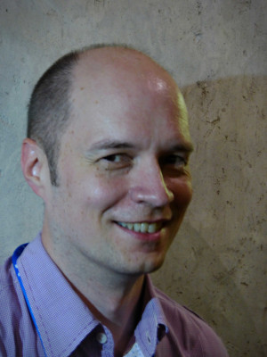

# Invited Speakers

<!--
**Talk recordings are available <a href="https://www.youtube.com/@AISTATSConference/featured">here</a>.**
-->

<h2 id="aapo-hyvaerinen"><a href="https://www.cs.helsinki.fi/u/ahyvarin/">Aapo Hyvärinen (University of Helsinki)</a></h2>

<b>Biography</b>:
Aapo Hyvärinen is Professor of Computer Science (Machine Learning) at the
University of Helsinki, Finland. He is also a Fellow at the European Laboratory
for Learning and Intelligent Systems (ELLIS). His research focuses on the
probabilistic theory of machine learning and its applications on neuroscience.
He is the main author of the books "Independent Component Analysis" (2001),
"Natural Image Statistics: A probabilistic approach to early computational
vision" (2009), and "Painful Intelligence: What AI can tell us about human
suffering" (2022/24).

 

<h2 id="chris-holmes"><a href="https://www.stats.ox.ac.uk/people/chris-holmes">Chris Holmes (University of Oxford; Ellison Institute of Technology)</a></h2>

<b>Biography</b>:
Chris Holmes is Statutory Professor of Biostatistics at the University of
Oxford, and Director of AI at the Ellison Institute of Technology. He gained
his PhD from Imperial College London, following an early career in industry
focused on scientific computing. Chris was the inaugural Programme Director for
Health and Medical Sciences at The Alan Turing Institute, serving in that role
until October 2023. He held a long-standing Programme Leader’s award in
Statistical Genomics from the UK Medical Research Council (MRC) for 18 years
and was named one of WIRED UK’s “Innovators of the Year in AI” in 2016. He is a
founding editorial board member of the New England Journal of Medicine AI, and
a founding Fellow of the European Laboratory for Learning and Intelligent
Systems (ELLIS), where he co-leads the programme on Robust Machine Learning.
Chris also serves on the International Scientific Advisory Board of UK Biobank
and on the Data Committee of the Novo Nordisk Foundation.

 

<h2 id="akshay-krishnamurthy"><a href="https://people.cs.umass.edu/~akshay/">Akshay Krishnamurthy (Microsoft Research, New York City)</a></h2>

<b>Biography</b>:
Akshay Krishnamurthy is a senior principal research manager at Microsoft
Research, New York City. He previously spent two years as an assistant
professor in the College of Information and Computer Sciences at the
University of Massachusetts, Amherst and a year as a postdoctoral
researcher at Microsoft Research, NYC. He completed my PhD in the Computer
Science Department at Carnegie Mellon University, advised by Aarti Singh
and received his undergraduate degree in EECS at UC Berkeley. His research
interests are broadly in the areas of machine learning and statistics. He
is most excited about interactive learning and decision making, including
reinforcement learning, and recently has been thinking about how
reinforcement learning can be used to improve modern generative AI
systems.

