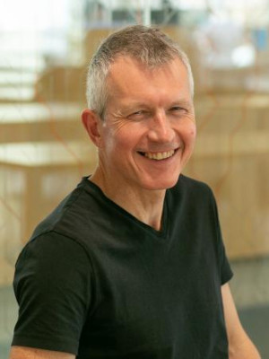
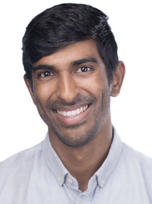

# Invited Speakers

<!--
**Talk recordings are available <a href="https://www.youtube.com/@AISTATSConference/featured">here</a>.**
-->

<h2 id="aapo-hyvaerinen"><a href="https://www.cs.helsinki.fi/u/ahyvarin/">Aap Hyvärinen (University of Helsinki)</a></h2>
<!--

<b>Biography</b>:
-->

 

<h2 id="chris-holmes"><a href="https://www.stats.ox.ac.uk/people/chris-holmes">Chris Holmes (University of Oxford)</a></h2>
<!--

<b>Biography</b>:
-->

 

<h2 id="akshay-krishnamurthy"><a href="https://people.cs.umass.edu/~akshay/">Akshay Krishnamurthy (Microsoft Research)</a></h2>
<!--

<b>Biography</b>:
-->

